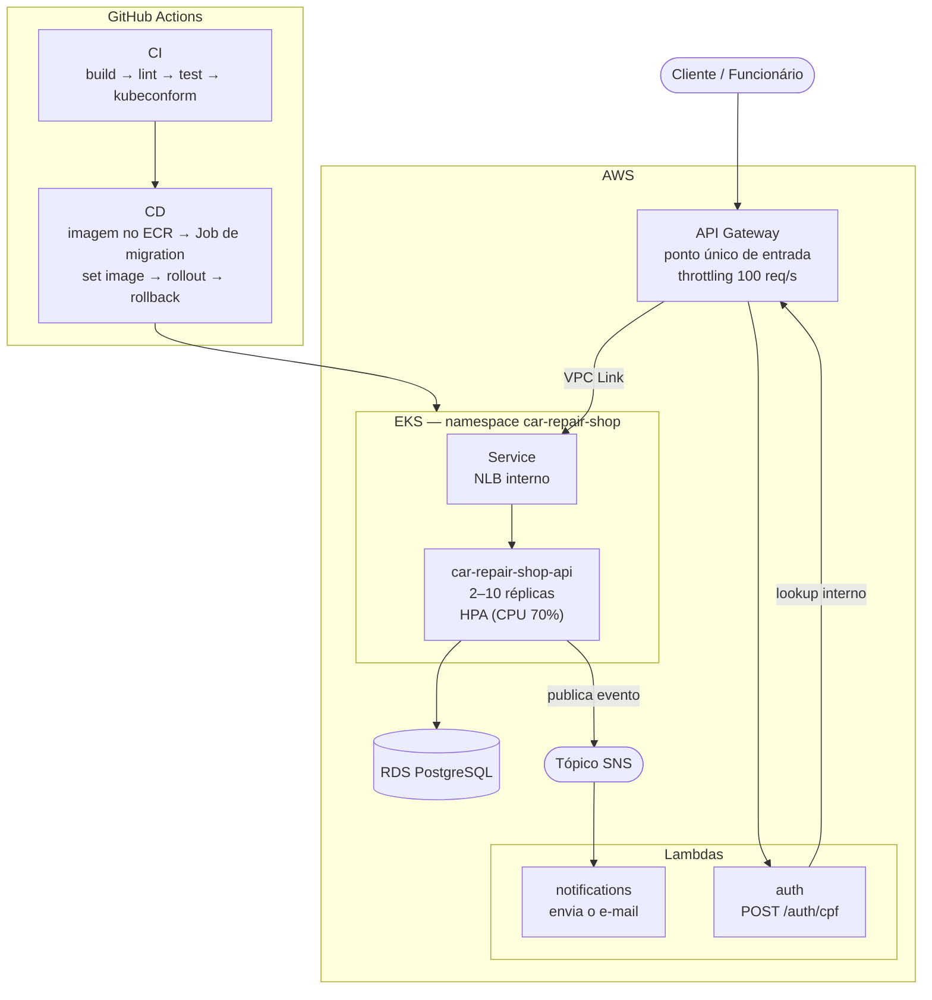

# Car Repair Shop API


REST API para gerenciar ordens de serviço de uma oficina mecânica — FIAP Tech Challenge Fase 3.

**Vídeo demonstrativo:** _a publicar_ — a preparação e o roteiro do que demonstrar estão no
[checklist de gravação](docs/checklist-gravacao.md).

> **Ambiente efêmero.** O sistema é provisionado do zero a cada sessão do Learner Lab e derrubado
> depois, para não consumir orçamento. A URL do API Gateway **muda a cada recriação** — a que
> aparece no vídeo não responde mais. Para subir tudo de novo, siga o
> [runbook do ambiente](docs/runbook-ambiente.md) (~38 min).

---

## Sumário

1. [Sobre a Fase 3](#sobre-a-fase-3)
2. [Documentação arquitetural](#documentação-arquitetural)
3. [Os quatro repositórios](#os-quatro-repositórios)
4. [Arquitetura](#arquitetura)
5. [Stack](#stack)
6. [Papéis de usuário](#papéis-de-usuário)
7. [Execução local — Docker Compose](#execução-local--docker-compose)
8. [Implantação na AWS](#implantação-na-aws)
9. [Observabilidade](#observabilidade)
10. [CI/CD](#cicd)
11. [Testes](#testes)
12. [Postman](#postman)
13. [API Reference (Swagger)](#api-reference-swagger)

---

## Sobre a Fase 3

A Fase 3 levou a aplicação do Minikube local para a AWS, decompôs a autenticação e a notificação em
functions serverless, e instrumentou o sistema para observabilidade:

- **Banco relacional**: Postgres no RDS, com Prisma e migrations aplicadas como Job antes do rollout.
- **Serverless**: autenticação por CPF e notificação por e-mail em Lambdas próprias, com o API
  Gateway como ponto único de entrada.
- **Comunicação híbrida**: síncrona onde há resposta a devolver, assíncrona via tópico SNS onde não
  há — a transição de status não espera o e-mail.
- **Observabilidade**: log estruturado, métricas de negócio e HTTP, tracing distribuído com
  propagação W3C, e o mesmo `trace_id` atravessando a fronteira assíncrona.
- **Dashboards e alertas**: quatro dashboards versionados como código e quatro regras de alerta.
- **Infraestrutura em três repositórios**: banco, cluster e functions, cada um com seu ciclo próprio.

O que veio da Fase 2 continua valendo: Clean Architecture, SOLID, testes com threshold de 80%,
CI/CD no GitHub Actions e HPA por CPU.

---

## Documentação arquitetural

| Documento | Conteúdo |
|---|---|
| [Diagrama de componentes](docs/architecture/components.md) | Visão dos componentes e das fronteiras |
| [Sequência — autenticação por CPF](docs/architecture/sequence-auth-cpf.md) | Gateway, function e lookup |
| [Sequência — ordem de serviço](docs/architecture/sequence-service-order.md) | Ciclo de vida da OS |
| [Modelo ER](docs/architecture/data-model.md) | Esquema relacional e restrições |
| [Matriz de autorização](docs/architecture/authorization-matrix.md) | As 40 rotas, quem acessa cada uma |
| [Índice de ADRs](docs/architecture/adr/README.md) | 11 decisões de arquitetura |
| [Índice de RFCs](docs/architecture/rfc/README.md) | 5 propostas técnicas |

Operacional: [runbook do ambiente](docs/runbook-ambiente.md),
[checklist de gravação](docs/checklist-gravacao.md),
[política de branches](docs/branching-policy.md).

---

## Os quatro repositórios

| Repositório | Responsabilidade |
|---|---|
| [`fiap-tech-challenge`](https://github.com/diandria/fiap-tech-challenge) | Aplicação (este) |
| [`fiap-tech-challenge-infra-db`](https://github.com/diandria/fiap-tech-challenge-infra-db) | VPC, RDS, segredos no SSM |
| [`fiap-tech-challenge-infra-k8s`](https://github.com/diandria/fiap-tech-challenge-infra-k8s) | EKS, API Gateway, ECR, observabilidade |
| [`fiap-tech-challenge-lambda`](https://github.com/diandria/fiap-tech-challenge-lambda) | Functions de autenticação e notificação, tópico SNS |

---

## Arquitetura

### Visão geral da arquitetura



A autenticação por CPF **não passa pela aplicação**: o gateway roteia `POST /auth/cpf` direto para a
Lambda, que consulta o cliente por um endpoint interno e emite o token
([ADR-002](docs/architecture/adr/ADR-002-function-emissora-de-token.md)).

A notificação é **assíncrona**: a aplicação publica no tópico e segue. A transição de status não
espera o e-mail ([ADR-003](docs/architecture/adr/ADR-003-padrao-de-comunicacao.md)).

### Clean Architecture — camadas

```
src/
├── entities/          ← Layer 1: domínio puro (ServiceOrder, Customer, state machine)
├── use-cases/         ← Layer 2: regras de aplicação + ports/interfaces
│   └── ports/         ← abstrações (IServiceOrderRepository, IStatusChangeNotifier…)
├── adapters/          ← Layer 3: controllers, gateways, presenters
└── frameworks/        ← Layer 4: Express, Prisma, rotas, main.ts
```

---

## Stack

| Tema | Escolha |
|---|---|
| Runtime | Node.js 22 LTS + TypeScript |
| HTTP | Express |
| Banco | PostgreSQL 16 + Prisma |
| Auth | JWT (jsonwebtoken) + bcryptjs |
| Log | pino — JSON estruturado ([ADR-010](docs/architecture/adr/ADR-010-biblioteca-de-log.md)) |
| Métricas | prom-client — HTTP, negócio e falhas de integração |
| Tracing | OpenTelemetry, propagação W3C `traceparent` |
| Notificações | AWS SDK v3 (SNS) em produção; console em desenvolvimento |
| Docs API | swagger-ui-express + swagger-jsdoc |
| Testes | Jest + ts-jest + Supertest + Testcontainers |
| Container | Docker + docker-compose |
| Orquestração | Kubernetes (Amazon EKS) |
| IaC | Terraform — nos três repositórios de infraestrutura |
| CI/CD | GitHub Actions, ambos em runner hospedado |

> **Node 22, e não 20.** O `testcontainers` adotado na migração para Postgres arrasta `undici@8`,
> que exige `>=22.19.0`, e o Node 20 saiu de suporte em abril de 2026.

---

## Papéis de usuário

O sistema tem **dois fluxos de autenticação**, com emissores diferentes.

**Funcionário** — `POST /auth/login` (e-mail e senha), emitido pela própria aplicação:

| Role | Permissões |
|---|---|
| `attendant` | Abre OS; cadastra clientes e veículos; registra entrega |
| `mechanic` | Executa diagnóstico; refina serviços e itens; executa e finaliza a OS |
| `admin` | Acesso total — inclui gestão de catálogo, estoque e usuários |

**Cliente** — `POST /auth/cpf` no API Gateway, emitido pela function serverless. O cliente consulta o
status e decide o orçamento **apenas da própria OS**: a titularidade é verificada dentro do caso de
uso, e não só a autenticação.

A confirmação com os primeiros 4 dígitos do CPF/CNPJ **permanece** em `PATCH
/service-orders/:id/budget`. O token diz *quem* está agindo; o código diz que a pessoa quis aprovar
*aquele* orçamento, e não clicou por engano.

> **A matriz completa** de rotas, perfis e fluxos está em
> [`docs/architecture/authorization-matrix.md`](docs/architecture/authorization-matrix.md) — todas as
> 40 rotas, quem acessa cada uma, e o critério das que continuam públicas.

---

## Execução local — Docker Compose

### Pré-requisitos

- Docker + docker-compose
- Node.js 22+ (apenas para `npm install` e `seed:dev`)

### 1. Variáveis de ambiente

```bash
cp .env.example .env
```

Edite `.env` se precisar mudar `ADMIN_PASSWORD` ou `JWT_SECRET`.

### 2. Subir os containers

```bash
npm install
docker-compose up -d
```

Sobe `app` (porta 3000) e `postgres` (porta 5432).

Na primeira execução, aplique as migrations:

```bash
npm run db:migrate
```

### 3. Popular o banco (opcional)

```bash
npm run seed:dev
```

Cria 5 serviços, 6 itens, 4 clientes, 7 veículos e 3 usuários (`admin@dev.local`, `attendant@dev.local`, `mechanic@dev.local`, senha `dev123`).

### 4. Verificar

```bash
curl http://localhost:3000/health
```

- API: <http://localhost:3000>
- Swagger: <http://localhost:3000/docs>

### Parar

```bash
docker-compose down          # mantém dados
docker-compose down -v       # remove volumes
```

### O que **não** roda localmente

Ser explícito aqui vale mais que fingir cobertura total: quem tentar e travar vai concluir que a
documentação está errada, e vai estar certo.

| Componente | Local | Observação |
|---|---|---|
| API + Postgres | sim | `docker-compose up -d` |
| Notificações | sim, no console | `NOTIFICATION_CHANNEL=console` imprime a mensagem em vez de publicar no SNS |
| **Autenticação por CPF** | **não** | `POST /auth/cpf` é servida pela Lambda, atrás do API Gateway — nenhum dos dois existe localmente |
| Observabilidade | não | Loki, Tempo, Prometheus e Grafana vivem no cluster; localmente os logs saem em JSON no stdout e as métricas ficam em `/metrics` |

**Como testar rotas de cliente sem o gateway:** autentique como `admin` em `POST /auth/login` e use
esse token. A titularidade é verificada dentro do caso de uso, então o comportamento de negócio é o
mesmo; o que não dá para exercitar localmente é a emissão do token pela function.

---

## Implantação na AWS

A aplicação roda em **Amazon EKS**, com Postgres no **RDS**, imagem no **ECR** e o **API Gateway**
como ponto único de entrada (ADR-001). O ambiente da Fase 2 (Minikube local, com runner
self-hosted) foi removido.

### Topologia

```
        internet
            │
    ┌───────▼────────┐
    │  API Gateway   │  throttling, rotas enumeradas
    └───────┬────────┘
            │ VPC Link
    ┌───────▼────────┐
    │  NLB interno   │  nunca público
    └───────┬────────┘
            │
    ┌───────▼────────┐      ┌──────────────┐
    │  EKS  (2 pods) │─────▶│  RDS Postgres│
    └───────┬────────┘      └──────────────┘
            │ SNS
    ┌───────▼────────────────┐
    │ Lambda de notificações │
    └────────────────────────┘
```

`POST /auth/cpf` é servida pela **Lambda de autenticação**, não pela aplicação.

### Repositórios de infraestrutura

| Repositório | Responsabilidade |
|---|---|
| `fiap-tech-challenge-infra-db` | VPC, RDS, segredos no SSM |
| `fiap-tech-challenge-infra-k8s` | EKS, API Gateway, ECR, observabilidade |
| `fiap-tech-challenge-lambda` | Functions de autenticação e notificação, tópico SNS |

A divisão segue o ciclo de vida: o `infra-k8s` provisiona o **ambiente** (cluster, node group, rede,
addons, observabilidade, API Gateway) e este repositório versiona os **artefatos de deploy da
aplicação** — Deployment, Service, HPA, ConfigMap e o Job de migration.

O **Namespace** fica no `infra-k8s`: ele existe antes de qualquer deploy e sobrevive a todos eles.

O **Service** mora aqui e é ele que faz nascer o NLB interno. Isso cria uma ordem de provisionamento:
a integração do API Gateway precisa do ARN do listener desse NLB, então ela é aplicada numa segunda
fase do `infra-k8s`, depois que o Service subiu. O [runbook](docs/runbook-ambiente.md) descreve a
sequência.

### Como implantar

O deploy é automático: merge na `main` → CI → CD. Não há passo manual.

O **runbook do ambiente efêmero** (subida completa a partir do zero, ordem obrigatória e descida)
está em [`docs/runbook-ambiente.md`](docs/runbook-ambiente.md).

### Ambiente único

O projeto usa **um ambiente só**. Não há homologação: `main` é produção.

```
<tipo>/<slug>  →  PR  →  revisão  →  merge na main  →  CD  →  produção
```

Isso é consequência do contexto — entrega acadêmica, ambiente efêmero recriado a cada sessão do
Learner Lab, com orçamento limitado. **Não é uma decisão de arquitetura, e por isso não tem ADR:**
um ADR que defendesse a escolha estaria fabricando argumento técnico para uma restrição.

O que substitui a rede de proteção que a homologação daria:

| Rede de proteção | Como é coberta |
|---|---|
| Regressão funcional | Suíte de integração com Postgres real via Testcontainers, obrigatória no CI |
| Erro de configuração de manifest | `kubeconform -strict` no CI, sem precisar de cluster |
| Migration destrutiva | Job próprio, antes do rollout, com `backoffLimit: 0` |
| Deploy quebrado | `rollout status` com **rollback automático**, e o workflow termina em vermelho |
| Revisão | PR obrigatório; nenhum push direto na `main` |
| Segredo divergente entre serviços | Todos leem o **mesmo parâmetro SSM** — não há cópias para divergir |

O ponto fraco que permanece: **não há ensaio antes de produção**. Uma falha só descoberta em runtime
chega ao ambiente real, e a mitigação é o rollback, não a prevenção.

### Manifests Kubernetes (`/k8s/`)

| Arquivo | Conteúdo |
|---|---|
| `01-config/configmap.yaml` | Configuração estática |
| `02-service/app-service.yaml` | Service `LoadBalancer` interno; origem do NLB |
| `03-app/app-deployment.yaml` | Deployment, sondas, requests e limits |
| `03-app/app-hpa.yaml` | HPA, 2 a 10 réplicas, 70% de CPU |
| `03-app/app-pdb.yaml` | PodDisruptionBudget |
| `04-jobs/migrate.yaml` | Job de migration, executado antes do rollout |

A configuração que vem da infraestrutura (endereço do Tempo, ARN do tópico) é criada pelo CD num
ConfigMap separado, `car-repair-shop-runtime`. Ela muda a cada ambiente recriado, e versioná-la
deixaria no repositório um valor que já não existe.

### Demonstrar o HPA (teste de carga com k6)

```bash
kubectl get hpa -n car-repair-shop -w
k6 run scripts/load-test.js
```


## Observabilidade

Três sinais, correlacionados pelo mesmo `trace_id`.

| Sinal | Onde | O que expõe |
|---|---|---|
| Log | Loki | JSON estruturado com `trace_id`, `span_id`, rota, status e duração |
| Métrica | Prometheus | latência HTTP por rota, OS abertas, tempo até cada status, falhas de integração |
| Trace | Tempo | spans da requisição, com propagação W3C `traceparent` |

O `trace_id` **atravessa a fronteira assíncrona**: a aplicação publica o `traceparent` no evento SNS
e a function de notificações o registra no próprio log. O mesmo identificador aparece dos dois lados,
apesar de não haver chamada síncrona entre eles.

Os dashboards e as regras de alerta são versionados como código no
[`infra-k8s`](https://github.com/diandria/fiap-tech-challenge-infra-k8s) — painel montado pela UI se
perderia no teardown do cluster.

| Dashboard | Conteúdo |
|---|---|
| Volume de ordens de serviço | Contagem e taxa de abertura |
| Tempo até cada status | Percentis e média por transição |
| Latência, healthchecks e uptime | p50/p95/p99 por rota, taxa de erro, uptime |
| Recursos do Kubernetes | CPU e memória contra requests e limites, réplicas contra o HPA |

Endpoint de métricas da aplicação: `GET /metrics`.

---

## CI/CD

### CI (`.github/workflows/ci.yml`)

Dispara em push e pull request para `main`. Roda em `ubuntu-latest`.

| Job | Necessita | Comando |
|---|---|---|
| `build` | — | `npm ci && npm run build` |
| `lint` | build | `npm run lint` |
| `test` | build | `npm test` |
| `coverage` | build, test | `npm run test:coverage` — faz upload do relatório como artefato |

### CD (`.github/workflows/cd.yml`)

Dispara via `workflow_run` quando o CI conclui com sucesso em `main`. Roda em runner hospedado do GitHub.

Passos: checkout no SHA exato → build e push da imagem no ECR com tag do SHA → leitura da configuração do SSM e do RDS → ConfigMap e Secret → **Job de migration** → `kubectl set image` → `rollout status` → **rollback automático** se falhar → verificação de fumaça em `/health` pelo gateway.

Os segredos vêm do **SSM**, não de secrets do GitHub: `JWT_SECRET` e `INTERNAL_TOKEN` são escritos ali pelo Terraform das functions, e a aplicação lê o mesmo parâmetro. Não existem duas cópias para divergir.

**GitHub Secrets necessários** (`Settings → Secrets and variables → Actions`):

| Secret | Descrição |
|---|---|
| `AWS_ACCESS_KEY_ID` | Credencial do Learner Lab |
| `AWS_SECRET_ACCESS_KEY` | Credencial do Learner Lab |
| `AWS_SESSION_TOKEN` | Credencial do Learner Lab — expira em ~4h |

São só esses três. `JWT_SECRET`, `INTERNAL_TOKEN` e a senha do admin **não** são secrets do GitHub:
vêm do SSM, escritos pelo Terraform. Mantê-los aqui recriaria duas cópias do que deve ser um valor
só.

As credenciais do Learner Lab expiram junto com a sessão. Para renová-las nos quatro repositórios:

```bash
~/dev/fiap-tech-challenge-lambda/scripts/refresh-aws-secrets.sh --todos
```

Cada deploy fica registrado em **Deployments → production**.

---

## Testes

```bash
npm test                  # unitários e integração (Testcontainers sobe um Postgres real)
npm run test:coverage     # com relatório de cobertura (threshold ≥ 80%)
```

### SonarQube (opcional)

```bash
docker-compose --profile sonar up -d sonarqube sonar-db
# 1. Acessar http://localhost:9000 (admin/admin → trocar senha)
# 2. Gerar token em My Account → Security
# 3. Preencher SONAR_HOST_URL e SONAR_TOKEN no .env

npm run test:coverage && npm run sonar
```

---

## Postman

A pasta `postman/` contém a coleção e os environments para cada ambiente.

| Environment | Arquivo | `baseUrl` |
|---|---|---|
| Local / Docker Compose | `car-repair-shop.postman_environment.json` | `http://localhost:3000` |
| Kubernetes / AWS | `car-repair-shop-k8s.postman_environment.json` | URL do API Gateway |

Importar: **Import → Upload Files** → selecione a collection + o environment desejado.

Para o ambiente na AWS, preencha `baseUrl` e `authBaseUrl` com a URL do API Gateway (`terraform output api_gateway_url` no `infra-k8s`).

Via CLI com Newman:

```bash
npx newman run postman/car-repair-shop.postman_collection.json \
  -e postman/car-repair-shop.postman_environment.json
```

Veja [`postman/README.md`](postman/README.md) para o fluxo detalhado.

---

## API Reference (Swagger)

| Ambiente | URL |
|---|---|
| Docker Compose | <http://localhost:3000/docs> |
| AWS | `<url-do-api-gateway>/docs` — obtenha com `terraform output -raw api_gateway_url` no `infra-k8s` |

### Autenticar no Swagger UI

1. `POST /auth/login` → **Try it out** → `{ "email": "admin@master.com", "password": "<ADMIN_PASSWORD>" }`
2. Copie o `token`
3. **Authorize** (cadeado) → cole o token sem o prefixo `Bearer ` → **Authorize**

### Endpoints públicos

| Endpoint | Descrição |
|---|---|
| `POST /auth/login` | Autentica e retorna JWT |
| `GET /health` | Liveness probe |
| `GET /ready` | Readiness probe |
| `GET /service-orders/:id/status` | Lê status e orçamento da OS |
| `PATCH /service-orders/:id/budget` | Aprova ou rejeita orçamento (rate-limited) |

