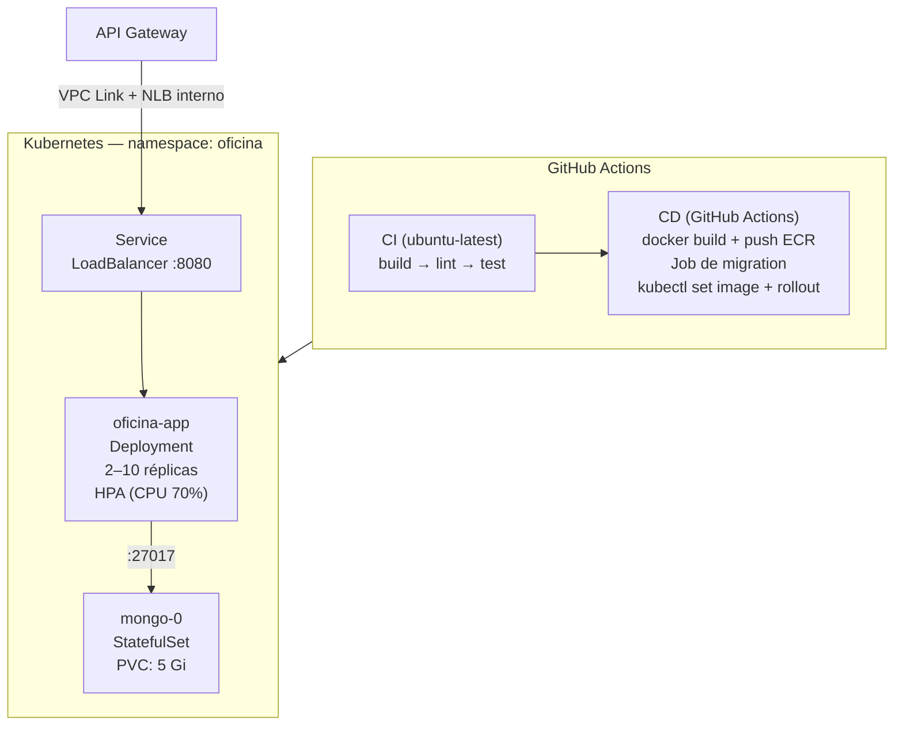

# Car Repair Shop API


REST API para gerenciar ordens de serviço de uma oficina mecânica — FIAP Tech Challenge Fase 2.

**Vídeo demonstrativo:** [assistir](https://drive.google.com/file/d/12GHq4ZRI1nZ-8uK1CyrCQ5obYXaEJFox/view?usp=sharing)

---

## Sumário

1. [Sobre a Fase 2](#sobre-a-fase-2)
2. [Arquitetura](#arquitetura)
3. [Stack](#stack)
4. [Papéis de usuário](#papéis-de-usuário)
5. [Execução local — Docker Compose](#execução-local--docker-compose)
6. [Implantação na AWS](#implantação-na-aws)
7. [Infraestrutura com Terraform](#infraestrutura-com-terraform)
8. [CI/CD](#cicd)
9. [Testes](#testes)
10. [Postman](#postman)
11. [API Reference (Swagger)](#api-reference-swagger)

---

## Sobre a Fase 2

A Fase 2 evoluiu a aplicação da Fase 1 com foco em qualidade, resiliência e escalabilidade:

- **Clean Architecture + SOLID**: refatoração com separação de camadas, ports/interfaces e eliminação de violações de DIP, SRP e OCP.
- **Testes automatizados**: cobertura de unitários e integração para todos os fluxos críticos (threshold ≥ 80%).
- **Containerização**: Dockerfile otimizado e docker-compose para desenvolvimento local.
- **Kubernetes**: manifests YAML com Deployment, Service (LoadBalancer), HPA (escala por CPU), PDB e StatefulSet do MongoDB.
- **IaC com Terraform**: provisionamento do cluster e aplicação dos manifests via provider `gavinbunney/kubectl`.
- **CI/CD**: pipeline completo no GitHub Actions — build, lint, teste, validação de manifests, imagem no ECR e deploy automatizado no EKS, com rollback se o rollout falhar.

---

## Arquitetura

> **Documentação em reconstrução.** A documentação arquitetural das fases anteriores foi removida.
> A da Fase 3 — diagrama de componentes, diagramas de sequência, RFCs, ADRs e modelo ER — será
> produzida na milestone M0 (ver `docs/phase-3-milestones.md`) e linkada aqui.

### Visão geral da arquitetura



### Clean Architecture — camadas

```
src/
├── entities/          ← Layer 1: domínio puro (ServiceOrder, Customer, state machine)
├── use-cases/         ← Layer 2: regras de aplicação + ports/interfaces
│   └── ports/         ← abstrações (IServiceOrderRepository, IStatusChangeNotifier…)
├── adapters/          ← Layer 3: controllers, gateways, presenters
└── frameworks/        ← Layer 4: Express, Prisma, rotas, main.ts
```

---

## Stack

| Tema | Escolha |
|---|---|
| Runtime | Node.js 20 + TypeScript |
| HTTP | Express |
| Banco | PostgreSQL 16 + Prisma |
| Auth | JWT (jsonwebtoken) + bcryptjs |
| Docs API | swagger-ui-express + swagger-jsdoc |
| Testes | Jest + ts-jest + Supertest + Testcontainers |
| Container | Docker + docker-compose |
| Orquestração | Kubernetes (Amazon EKS) |
| IaC | Terraform (`gavinbunney/kubectl` provider) |
| CI/CD | GitHub Actions (CI em ubuntu-latest, CD em self-hosted) |

---

## Papéis de usuário

O sistema tem **dois fluxos de autenticação**, com emissores diferentes.

**Funcionário** — `POST /auth/login` (e-mail e senha), emitido pela própria aplicação:

| Role | Permissões |
|---|---|
| `attendant` | Abre OS; cadastra clientes e veículos; registra entrega |
| `mechanic` | Executa diagnóstico; refina serviços e itens; executa e finaliza a OS |
| `admin` | Acesso total — inclui gestão de catálogo, estoque e usuários |

**Cliente** — `POST /auth/cpf` no API Gateway, emitido pela function serverless. O cliente consulta o
status e decide o orçamento **apenas da própria OS**: a titularidade é verificada dentro do caso de
uso, e não só a autenticação.

A confirmação com os primeiros 4 dígitos do CPF/CNPJ **permanece** em `PATCH
/service-orders/:id/budget`. O token diz *quem* está agindo; o código diz que a pessoa quis aprovar
*aquele* orçamento, e não clicou por engano.

> **A matriz completa** de rotas, perfis e fluxos está em
> [`docs/architecture/authorization-matrix.md`](docs/architecture/authorization-matrix.md) — todas as
> 40 rotas, quem acessa cada uma, e o critério das que continuam públicas.

---

## Execução local — Docker Compose

### Pré-requisitos

- Docker + docker-compose
- Node.js 20+ (apenas para `npm install` e `seed:dev`)

### 1. Variáveis de ambiente

```bash
cp .env.example .env
```

Edite `.env` se precisar mudar `ADMIN_PASSWORD` ou `JWT_SECRET`.

### 2. Subir os containers

```bash
npm install
docker-compose up -d
```

Sobe `app` (porta 3000) e `postgres` (porta 5432).

Na primeira execução, aplique as migrations:

```bash
npm run db:migrate
```

### 3. Popular o banco (opcional)

```bash
npm run seed:dev
```

Cria 5 serviços, 6 itens, 4 clientes, 7 veículos e 3 usuários (`admin@dev.local`, `attendant@dev.local`, `mechanic@dev.local`, senha `dev123`).

### 4. Verificar

```bash
curl http://localhost:3000/health
```

- API: <http://localhost:3000>
- Swagger: <http://localhost:3000/docs>

### Parar

```bash
docker-compose down          # mantém dados
docker-compose down -v       # remove volumes
```

---

## Implantação na AWS

A aplicação roda em **Amazon EKS**, com Postgres no **RDS**, imagem no **ECR** e o **API Gateway**
como ponto único de entrada (ADR-001). O ambiente da Fase 2 (Minikube local, com runner
self-hosted) foi removido.

### Topologia

```
        internet
            │
    ┌───────▼────────┐
    │  API Gateway   │  throttling, rotas enumeradas
    └───────┬────────┘
            │ VPC Link
    ┌───────▼────────┐
    │  NLB interno   │  nunca público
    └───────┬────────┘
            │
    ┌───────▼────────┐      ┌──────────────┐
    │  EKS  (2 pods) │─────▶│  RDS Postgres│
    └───────┬────────┘      └──────────────┘
            │ SNS
    ┌───────▼────────────────┐
    │ Lambda de notificações │
    └────────────────────────┘
```

`POST /auth/cpf` é servida pela **Lambda de autenticação**, não pela aplicação.

### Repositórios de infraestrutura

| Repositório | Responsabilidade |
|---|---|
| `fiap-tech-challenge-infra-db` | VPC, RDS, segredos no SSM |
| `fiap-tech-challenge-infra-k8s` | EKS, API Gateway, ECR, observabilidade |
| `fiap-tech-challenge-lambda` | Functions de autenticação e notificação, tópico SNS |

O **Namespace** e o **Service** da aplicação são criados pelo `infra-k8s`, e não pelos manifests
deste repositório: é o Service que faz nascer o NLB, e o API Gateway precisa do ARN do listener
dele. Se viessem junto do deploy, o endereço público mudaria a cada redeploy.

### Como implantar

O deploy é automático: merge na `main` → CI → CD. Não há passo manual.

O **runbook do ambiente efêmero** (subida completa a partir do zero, ordem obrigatória e descida)
está em [`docs/runbook-ambiente.md`](docs/runbook-ambiente.md).

### Ambiente único

O projeto usa **um ambiente só**. Não há homologação: `main` é produção.

```
<tipo>/<slug>  →  PR  →  revisão  →  merge na main  →  CD  →  produção
```

Isso é consequência do contexto — entrega acadêmica, ambiente efêmero recriado a cada sessão do
Learner Lab, com orçamento limitado. **Não é uma decisão de arquitetura, e por isso não tem ADR:**
um ADR que defendesse a escolha estaria fabricando argumento técnico para uma restrição.

O que substitui a rede de proteção que a homologação daria:

| Rede de proteção | Como é coberta |
|---|---|
| Regressão funcional | Suíte de integração com Postgres real via Testcontainers, obrigatória no CI |
| Erro de configuração de manifest | `kubeconform -strict` no CI, sem precisar de cluster |
| Migration destrutiva | Job próprio, antes do rollout, com `backoffLimit: 0` |
| Deploy quebrado | `rollout status` com **rollback automático**, e o workflow termina em vermelho |
| Revisão | PR obrigatório; nenhum push direto na `main` |
| Segredo divergente entre serviços | Todos leem o **mesmo parâmetro SSM** — não há cópias para divergir |

O ponto fraco que permanece: **não há ensaio antes de produção**. Uma falha só descoberta em runtime
chega ao ambiente real, e a mitigação é o rollback, não a prevenção.

### Manifests Kubernetes (`/k8s/`)

| Arquivo | Conteúdo |
|---|---|
| `01-config/configmap.yaml` | Configuração estática |
| `03-app/app-deployment.yaml` | Deployment, sondas, requests e limits |
| `03-app/app-hpa.yaml` | HPA, 2 a 10 réplicas, 70% de CPU |
| `03-app/app-pdb.yaml` | PodDisruptionBudget |
| `04-jobs/migrate.yaml` | Job de migration, executado antes do rollout |

A configuração que vem da infraestrutura (endereço do Tempo, ARN do tópico) é criada pelo CD num
ConfigMap separado, `car-repair-shop-runtime`. Ela muda a cada ambiente recriado, e versioná-la
deixaria no repositório um valor que já não existe.

### Demonstrar o HPA (teste de carga com k6)

```bash
kubectl get hpa -n car-repair-shop -w
k6 run scripts/load-test.js
```


## Infraestrutura com Terraform

Provider: `gavinbunney/kubectl ~> 1.14` — aplica manifests YAML sem conversão para recursos Terraform nativos.

Os recursos usam `fileset` + `for_each` agrupados por diretório, com um recurso individual para o Secret (usa `templatefile()` para injetar as variáveis sensíveis).

| Recurso Terraform | Manifests aplicados | Depende de |
|---|---|---|
| `kubectl_manifest.namespaces[*]` | `k8s/00-namespaces/*.yaml` | — |
| `kubectl_manifest.config[*]` | `k8s/01-config/*.yaml` | namespaces |
| `kubectl_manifest.mongo[*]` | `k8s/02-mongo/*.yaml` | config |
| `kubectl_manifest.secret` | `k8s/secret.yaml` (templatefile) | namespaces |
| `kubectl_manifest.app[*]` | `k8s/03-app/*.yaml` | mongo, secret |

---

## CI/CD

### CI (`.github/workflows/ci.yml`)

Dispara em push e pull request para `main`. Roda em `ubuntu-latest`.

| Job | Necessita | Comando |
|---|---|---|
| `build` | — | `npm ci && npm run build` |
| `lint` | build | `npm run lint` |
| `test` | build | `npm test` |
| `coverage` | build, test | `npm run test:coverage` — faz upload do relatório como artefato |

### CD (`.github/workflows/cd.yml`)

Dispara via `workflow_run` quando o CI conclui com sucesso em `main`. Roda em runner hospedado do GitHub.

Passos: checkout no SHA exato → build e push da imagem no ECR com tag do SHA → leitura da configuração do SSM e do RDS → ConfigMap e Secret → **Job de migration** → `kubectl set image` → `rollout status` → **rollback automático** se falhar → verificação de fumaça em `/health` pelo gateway.

Os segredos vêm do **SSM**, não de secrets do GitHub: `JWT_SECRET` e `INTERNAL_TOKEN` são escritos ali pelo Terraform das functions, e a aplicação lê o mesmo parâmetro. Não existem duas cópias para divergir.

**GitHub Secrets necessários** (`Settings → Secrets and variables → Actions`):

| Secret | Descrição |
|---|---|
| `JWT_SECRET` | Segredo para assinar tokens JWT |
| `ADMIN_PASSWORD` | Senha do usuário administrador |
| `MONGO_ROOT_USERNAME` | Usuário root do MongoDB |
| `MONGO_ROOT_PASSWORD` | Senha root do MongoDB |

---

## Testes

```bash
npm test                  # todos os testes (sem MongoDB externo)
npm run test:coverage     # com relatório de cobertura (threshold ≥ 80%)
```

### SonarQube (opcional)

```bash
docker-compose --profile sonar up -d sonarqube sonar-db
# 1. Acessar http://localhost:9000 (admin/admin → trocar senha)
# 2. Gerar token em My Account → Security
# 3. Preencher SONAR_HOST_URL e SONAR_TOKEN no .env

npm run test:coverage && npm run sonar
```

---

## Postman

A pasta `postman/` contém a coleção e os environments para cada ambiente.

| Environment | Arquivo | `baseUrl` |
|---|---|---|
| Local / Docker Compose | `car-repair-shop.postman_environment.json` | `http://localhost:3000` |
| Kubernetes / AWS | `car-repair-shop-k8s.postman_environment.json` | URL do API Gateway |

Importar: **Import → Upload Files** → selecione a collection + o environment desejado.

Para o ambiente na AWS, preencha `baseUrl` e `authBaseUrl` com a URL do API Gateway (`terraform output api_gateway_url` no `infra-k8s`).

Via CLI com Newman:

```bash
npx newman run postman/car-repair-shop.postman_collection.json \
  -e postman/car-repair-shop.postman_environment.json
```

Veja [`postman/README.md`](postman/README.md) para o fluxo detalhado.

---

## API Reference (Swagger)

| Ambiente | URL |
|---|---|
| Docker Compose | <http://localhost:3000/docs> |
| Kubernetes | <http://localhost:8080/docs> |

### Autenticar no Swagger UI

1. `POST /auth/login` → **Try it out** → `{ "email": "admin@master.com", "password": "<ADMIN_PASSWORD>" }`
2. Copie o `token`
3. **Authorize** (cadeado) → cole o token sem o prefixo `Bearer ` → **Authorize**

### Endpoints públicos

| Endpoint | Descrição |
|---|---|
| `POST /auth/login` | Autentica e retorna JWT |
| `GET /health` | Liveness probe |
| `GET /ready` | Readiness probe |
| `GET /service-orders/:id/status` | Lê status e orçamento da OS |
| `PATCH /service-orders/:id/budget` | Aprova ou rejeita orçamento (rate-limited) |

