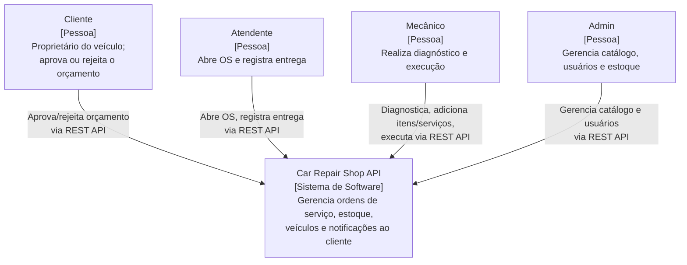
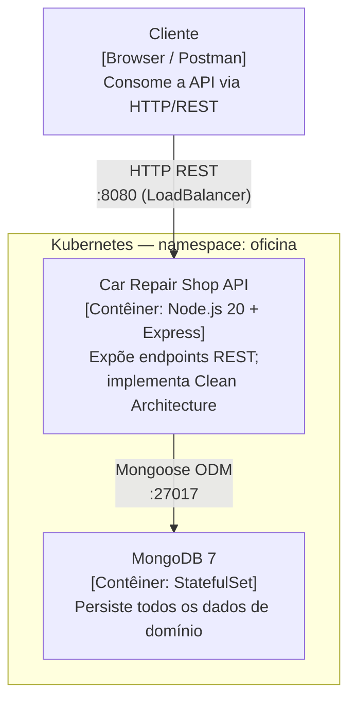
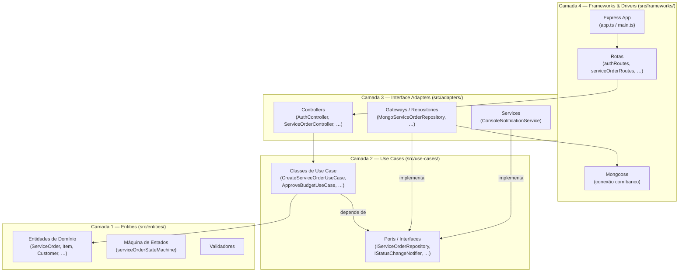

# Diagramas C4 — Car Repair Shop API

## Nível 1 — Contexto do Sistema

Quem interage com o sistema e quais sistemas externos estão envolvidos.

## Nível 2 — Contêineres

Contêineres de software em execução que compõem o sistema em tempo de execução.

> O fluxo de deploy (CI/CD, Terraform, scripts de infraestrutura) está documentado em [docs/infrastructure/deploy-flow.md](../infrastructure/deploy-flow.md).

## Nível 3 — Componentes

Estrutura interna da API seguindo Clean Architecture.

