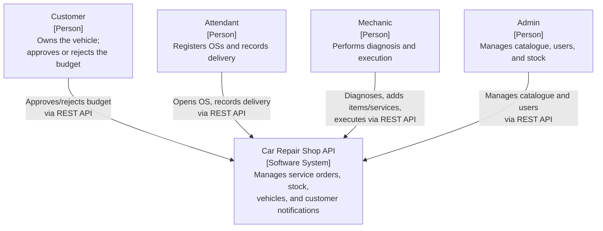
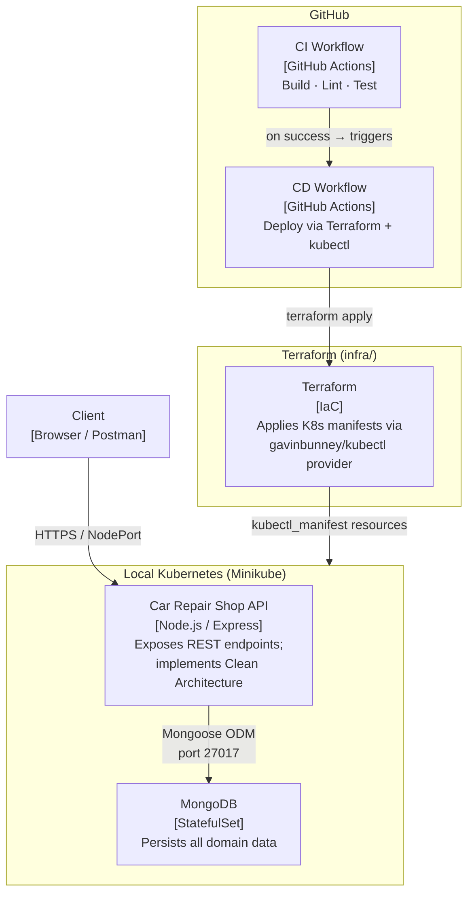
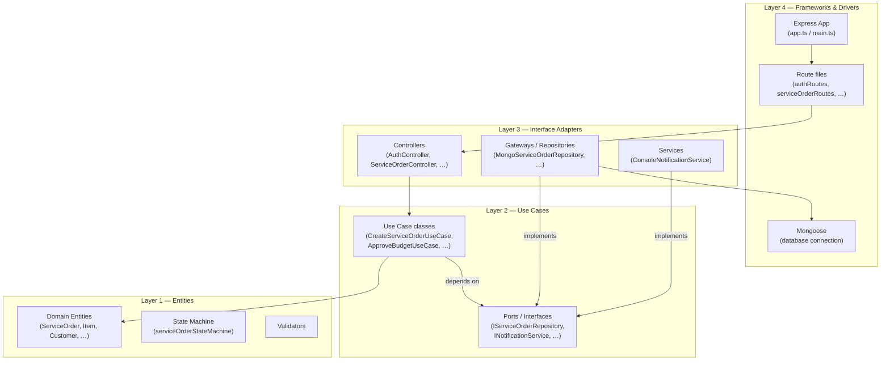

# C4 Architecture Diagrams

## Level 1 — System Context

Who interacts with the Car Repair Shop system and what external systems are involved.

## Level 2 — Container

How the system is deployed and how its main containers communicate.

## Level 3 — Component

Internal structure of the Car Repair Shop API following Clean Architecture.

