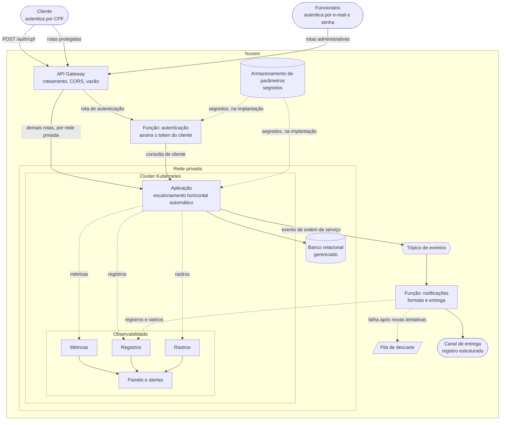

# Diagrama de componentes

Visão dos componentes do sistema, das fronteiras de nuvem e rede, e dos caminhos de observabilidade.

## Visão geral

## Como ler

O retângulo externo é a nuvem, o interno é a rede privada. Só o API Gateway tem endereço público. O
balanceador do cluster é interno e alcançável apenas a partir dele
([ADR-001](adr/ADR-001-ponto-unico-de-entrada.md)). As funções serverless rodam fora da rede privada,
porque não acessam o banco.

São dois atores e dois caminhos de autenticação. O cliente troca o CPF por um token na função emissora. O
funcionário autentica direto na aplicação, com e-mail e senha e controle por papel. Os dois modelos
coexistem porque os atores são diferentes ([RFC-003](rfc/RFC-003-estrategia-de-autenticacao.md)).

A função de autenticação consulta a aplicação, não o banco. Ela tem responsabilidade única, que é assinar
o token. Validação de documento e consulta de cliente ficam onde já estão implementadas
([ADR-002](adr/ADR-002-function-emissora-de-token.md)).

Setas cheias são síncronas, tracejadas são assíncronas. A publicação do evento de ordem de serviço não
espera a entrega da notificação, e a fila de descarte recebe o que falhou depois das novas tentativas
([ADR-003](adr/ADR-003-padrao-de-comunicacao.md)).

**A entrega da notificação é um registro estruturado, não um e-mail.** É deliberado: o ambiente é de
demonstração e não há destinatário real para receber correio da oficina. A função formata a mensagem
completa — destinatário, assunto e corpo — e a emite como registro, que fica pesquisável junto dos
demais. Trocar por um canal real é implementar a mesma interface, sem tocar na formatação.

Os segredos vêm de um **armazenamento de parâmetros**, lido na implantação tanto pela aplicação quanto
pela função de autenticação. É o que garante que o segredo de assinatura do token seja o mesmo dos dois
lados: não existem duas cópias para divergir, porque é o mesmo parâmetro.

A observabilidade vive no próprio cluster e é provisionada junto com ele
([ADR-005](adr/ADR-005-observabilidade-self-hosted.md)). A função de notificações também emite registros e
rastros: ela é o primeiro contexto fora do processo principal, e serve de teste real das convenções de
telemetria ([ADR-007](adr/ADR-007-telemetria-microsservicos.md)).

## Componentes

| Componente | Responsabilidade | Decisão relacionada |
|---|---|---|
| API Gateway | Ponto único de entrada; roteamento, CORS e controle de vazão | ADR-001, ADR-006 |
| Função de autenticação | Assinar e devolver o token do cliente | ADR-002 |
| Função de notificações | Formatar e entregar a notificação a partir do evento | ADR-003 |
| Tópico de eventos | Desacoplar a publicação da entrega | ADR-003 |
| Fila de descarte | Reter o que falhou após as novas tentativas | ADR-003 |
| Canal de entrega | Emitir a notificação formatada; neste ambiente, como registro estruturado | ADR-003 |
| Armazenamento de parâmetros | Fonte única dos segredos, lida na implantação pelos dois lados | — |
| Aplicação | Regras de negócio e API | ADR-009 |
| Banco relacional gerenciado | Persistência com integridade garantida pelo banco | RFC-002 |
| Stack de observabilidade | Métricas, registros, rastros, painéis e alertas | ADR-005, RFC-005 |
