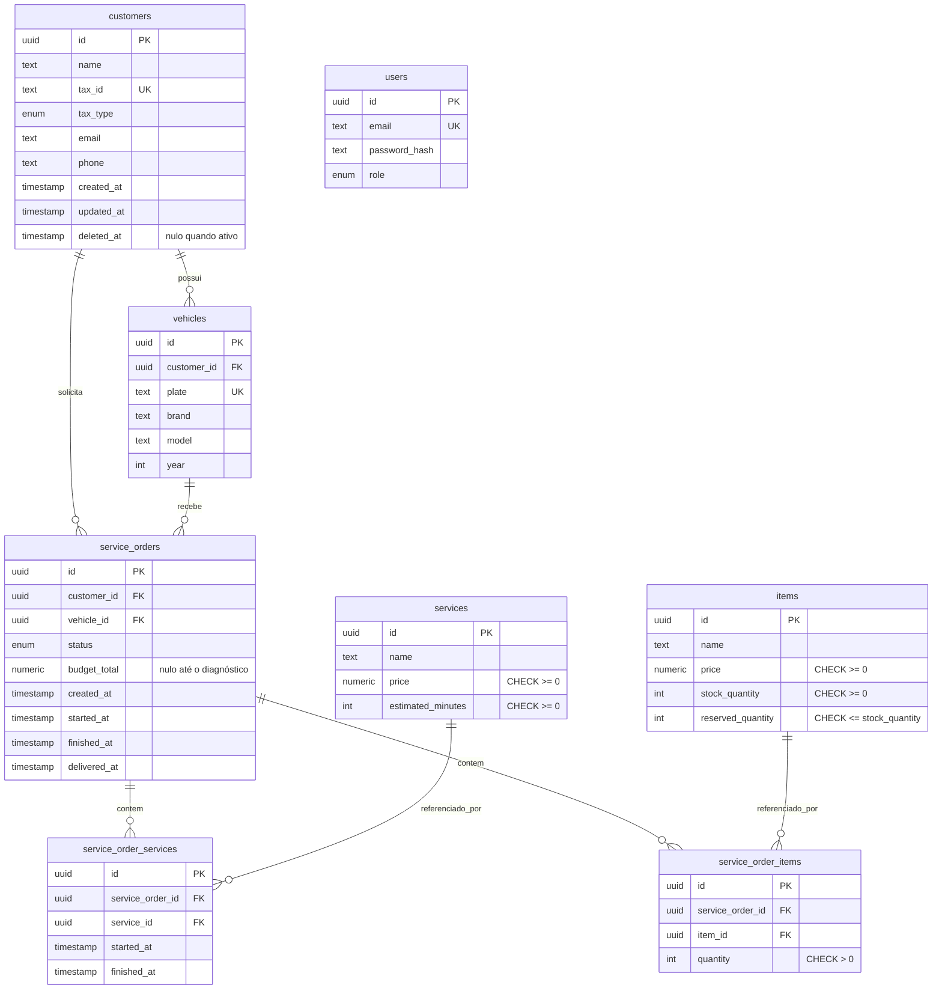

# Modelo de dados

Modelo relacional da oficina, com a explicação de cada relacionamento e das restrições que o banco passa
a garantir. Este documento é a fonte de verdade do esquema: a definição executável o traduz, e não o
contrário.

A justificativa da escolha do banco está na [RFC-002](rfc/RFC-002-banco-de-dados.md).

## Diagrama

## Relacionamentos

Cada um responde três coisas: a cardinalidade, por que existe no negócio, e o que a chave estrangeira
impede que aconteça. Essa terceira é a parte que dá valor à migração.

### `vehicles.customer_id` → `customers.id` (N:1)

Um veículo pertence a um cliente; um cliente acumula vários veículos ao longo do tempo. A chave impede
cadastrar veículo para um cliente que não existe. Hoje, com o identificador como texto livre, isso passa
sem erro e só aparece quando alguém tenta listar os veículos daquele cliente e recebe uma lista vazia
sem explicação.

### `service_orders.customer_id` → `customers.id` (N:1)

Uma ordem de serviço é sempre de um cliente; um cliente acumula ordens ao longo do tempo. A chave impede
abrir ordem para cliente inexistente, e é o que garante que a verificação de titularidade, que decide
quem pode aprovar um orçamento, tenha em que se apoiar.

### `service_orders.vehicle_id` → `vehicles.id` (N:1)

Uma ordem existe sempre para um veículo específico; um veículo acumula várias ordens. A chave impede
abrir ordem para veículo não cadastrado. Sem ela, o erro só é descoberto quando a ordem é consultada,
longe, no tempo e no código, de onde o dado errado entrou.

### `service_order_services` (N:N entre ordens e serviços)

Uma ordem contém vários serviços, e um serviço do catálogo aparece em várias ordens. A tabela existe
porque a relação **tem atributos próprios**: quando aquele serviço começou e quando terminou, naquela
ordem específica. Sem a tabela associativa, esses dois campos não teriam onde morar.

A restrição de unicidade sobre o par impede registrar o mesmo serviço duas vezes na mesma ordem.

### `service_order_items` (N:N entre ordens e peças)

Mesma estrutura, com um atributo diferente: a quantidade daquela peça naquela ordem. A restrição
`quantity > 0` impede registrar uma peça com quantidade zero ou negativa, o que corromperia o cálculo do
orçamento em silêncio.

### `users`, isolada de propósito

A tabela não tem nenhuma chave estrangeira, e não é esquecimento. O funcionário é um ator do sistema, não
um participante do negócio da oficina: ele não é dono de veículo nem de ordem de serviço. A ausência de
relacionamento é a modelagem correta.

O contraste com `customers` ajuda a ver. As duas guardam pessoas, e têm papéis opostos no modelo. Uma
está no centro, com relacionamentos para quase tudo. A outra não é referenciada por nada e não referencia
nada. Se um dia for preciso saber qual mecânico executou qual serviço, aí aparece um relacionamento, e
será uma decisão nova, com registro próprio.

## Restrições de domínio

O que deixa de depender de disciplina da aplicação e passa a ser garantido pelo banco:

| Restrição | O que impede |
|---|---|
| `items.reserved_quantity <= items.stock_quantity` | Reservar peça além do estoque disponível, inclusive sob corrida entre réplicas |
| `items.stock_quantity >= 0` e `reserved_quantity >= 0` | Estoque negativo |
| `service_order_items.quantity > 0` | Peça com quantidade nula ou negativa no orçamento |
| `services.price >= 0` e `estimated_minutes >= 0` | Valor ou duração negativos no catálogo |
| `customers.tax_id` único | Dois cadastros para o mesmo documento |
| `vehicles.plate` única | Dois cadastros para a mesma placa |
| `status` como tipo enumerado | Status fora da máquina de estados |

A primeira é a mais relevante. Hoje o invariante é sustentado por código de aplicação que roda em várias
réplicas simultâneas: duas reservas concorrentes podem ler o mesmo valor e ambas escrever, perdendo um
incremento. Com a restrição no banco, a operação falha em vez de corromper o dado em silêncio.

## Índices

Cada um existe por causa de uma consulta específica:

| Índice | Consulta que sustenta |
|---|---|
| `service_orders(status, created_at)` | Listagem de ordens ativas, ordenada por prioridade operacional |
| `service_orders(customer_id)` | Ordens de um cliente e verificação de titularidade |
| `vehicles(customer_id)` | Veículos de um cliente |
| `customers(tax_id)` | Consulta por documento na autenticação (caminho quente, executado a cada login de cliente) |

## Decisões de modelagem

Sobre as tabelas associativas terem chave própria em vez de chave composta pelos dois identificadores: a
chave composta seria mais enxuta, mas fecharia a porta para o domínio permitir que a mesma ordem registre
o mesmo serviço em momentos distintos, cada linha com seu próprio início e fim. A chave própria mantém
essa possibilidade aberta sem migração futura, e a restrição de unicidade preserva o comportamento
atual.

Sobre valores monetários usarem tipo decimal e não ponto flutuante: ponto flutuante acumula erro de
arredondamento, e o cálculo do orçamento soma preços de serviços e peças. O erro é pequeno em cada
operação e visível na fatura.

Sobre a exclusão de cliente ser lógica e não física: o campo de data de exclusão preserva o histórico de
ordens de serviço, que continuam válidas para consulta. Um cliente excluído deixa de aparecer nas
listagens e de autenticar, mas suas ordens permanecem.
