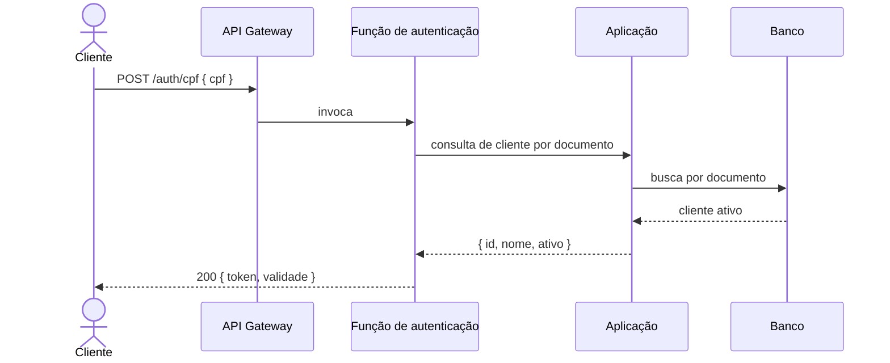
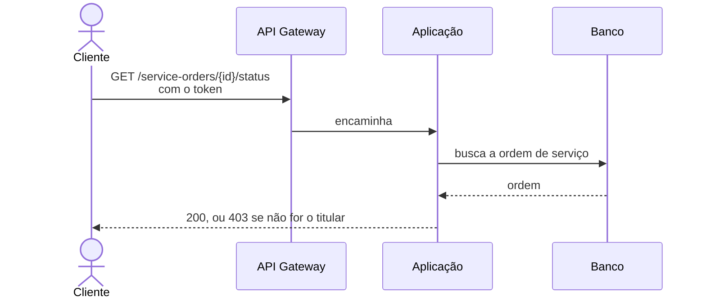

# Diagramas de sequência (autenticação por CPF)

Nível de serviço e recurso. Os participantes são componentes que existem na infraestrutura e aparecem no
[diagrama de componentes](components.md). Nenhum deles é classe interna.

## 1. Emissão do token

A função não consulta o banco. Ela pergunta à aplicação, que já sabe validar o documento e encontrar o
cliente. A responsabilidade única da função é assinar o token
([ADR-002](adr/ADR-002-function-emissora-de-token.md)).

## 2. Uso do token numa rota protegida

Sem este segundo diagrama, o primeiro termina no vazio: mostra o token sendo criado e nunca sendo usado.

A verificação de titularidade acontece na aplicação, não no gateway. Autenticar prova quem a pessoa é.
Provar que ela pode agir sobre aquela ordem específica é outra decisão, e vive junto da regra de negócio
([ADR-008](adr/ADR-008-escopo-autenticacao-cliente.md)).

## Caminhos de erro

Nenhum deles muda quem conversa com quem, só o código de resposta. Por isso viram tabela, e não ramo no
diagrama.

| Situação | A aplicação responde | A função devolve |
|---|---|---|
| Documento com dígito verificador inválido | 400 | 400 |
| Cliente não encontrado | 404 | **401** |
| Cliente inativo | 200, marcado como inativo | 403 |
| Aplicação indisponível | não responde | 503 |

Sobre devolver erro de credencial em vez de "não encontrado": a distinção transformaria o endpoint num
oráculo de enumeração, porque seria possível descobrir quem é cliente da oficina testando documentos. O
erro genérico fecha essa porta.
