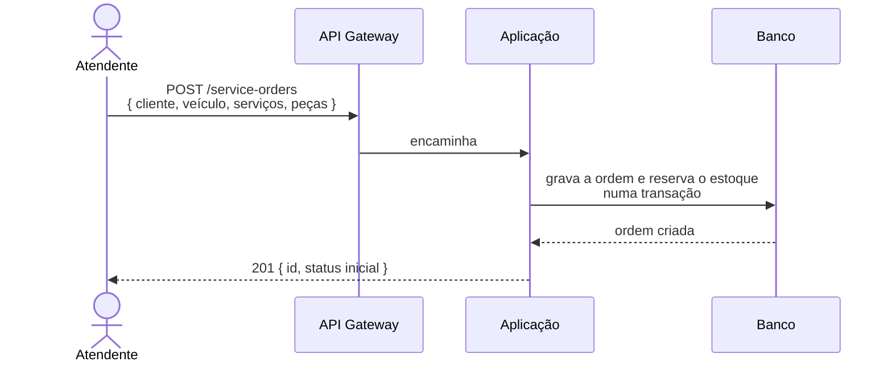
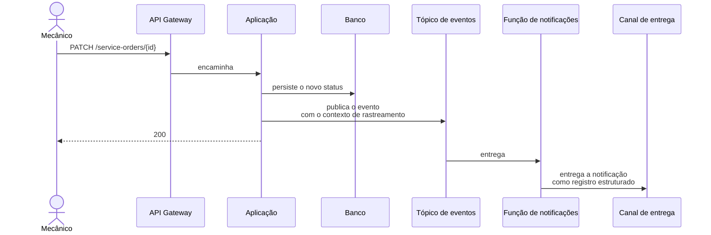

# Diagramas de sequência (ordem de serviço)

Nível de serviço e recurso. Os participantes aparecem no [diagrama de componentes](components.md).

## 1. Abertura da ordem de serviço

A reserva de estoque aparece como uma mensagem, não como um laço. Validar cada serviço no catálogo,
conferir disponibilidade peça a peça e reverter reservas parciais em caso de falha é regra de domínio, e
vive dentro da aplicação.

Desenhar esses passos aqui contaria como a aplicação funciona por dentro, e o diagrama passaria a mentir
na primeira refatoração, sem que nada tenha de fato mudado na interação entre serviços. As regras de
estoque estão descritas no [modelo de dados](data-model.md), onde as restrições que as garantem são
declaradas.

## 2. Mudança de status e notificação assíncrona

Este é o diagrama mais informativo dos quatro. Ele mostra a costura assíncrona: a resposta ao mecânico
sai antes de o e-mail ser enviado, e a entrega acontece depois, noutro processo
([ADR-003](adr/ADR-003-padrao-de-comunicacao.md)).

É também o único lugar da documentação onde a fronteira de mensageria fica visível, e onde se vê por que
o contexto de rastreamento viaja no evento. Sem ele, o rastro terminaria na publicação, e a jornada
apareceria como dois pedaços desconexos.

## O que os dois diagramas deixam de fora, de propósito

| Fora do diagrama | Onde está documentado |
|---|---|
| Validação de serviços e peças na abertura | Modelo de dados, nas restrições de chave estrangeira |
| Reversão de reservas parciais | Regra de domínio, na camada de casos de uso |
| Transições válidas entre status | Máquina de estados, na camada de entidades |
| Nova tentativa e descarte da notificação | ADR-003 |
