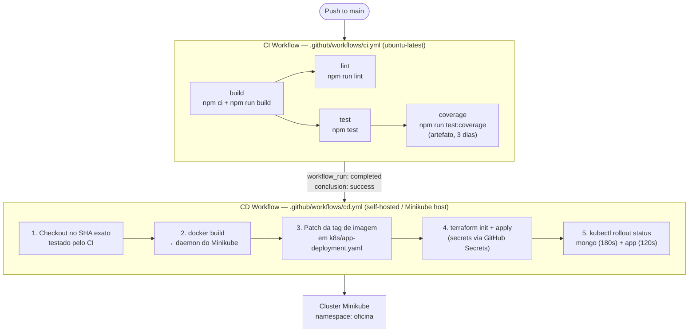

# Deployment Flow

## CI/CD Pipeline

All deployments are gated by the CI pipeline. CD listens for CI completion via `workflow_run`; it only runs when CI succeeds on `main`.



> A visão da infraestrutura provisionada (recursos do cluster) está em [solution-design.md](solution-design.md).

### CI jobs

| Job | Needs | Runner | Command |
|---|---|---|---|
| `build` | — | ubuntu-latest | `npm ci && npm run build` |
| `lint` | build | ubuntu-latest | `npm run lint` |
| `test` | build | ubuntu-latest | `npm test` |
| `coverage` | build, test | ubuntu-latest | `npm run test:coverage` — faz upload do relatório como artefato (retido 3 dias) |

### CD steps

| Step | Detail |
|---|---|
| Checkout | `actions/checkout@v4` with `ref: github.event.workflow_run.head_sha` — pins to the exact CI-tested commit |
| Image tag | Short git SHA (`git rev-parse --short HEAD`) |
| Docker build | `eval $(minikube docker-env)` then `docker build` — image stays inside Minikube's daemon |
| Manifest patch | `sed` replaces the image tag in `k8s/app-deployment.yaml`; guarded by a `grep` assertion |
| Terraform apply | `terraform init -input=false && terraform apply -auto-approve -input=false` from `infra/` |
| Rollout verify | `kubectl rollout status statefulset/mongo` (180 s) then `kubectl rollout status deployment/oficina-app` (120 s) |

CD has `concurrency: { group: deploy, cancel-in-progress: true }` — overlapping runs cancel the older one. Total job timeout is 15 minutes.

---

## Kubernetes Manifests (`k8s/`)

| File | Kind | Purpose |
|---|---|---|
| `namespace.yaml` | Namespace | Isolates all resources under `oficina` |
| `configmap.yaml` | ConfigMap | Non-secret env vars: `PORT`, `CORS_ORIGIN`, `ADMIN_EMAIL`, `SMTP_HOST`, `SMTP_PORT`, `SMTP_SECURE`, `SMTP_FROM` |
| `secret.yaml` | Secret | Sensitive env vars: `MONGODB_URI`, `JWT_SECRET`, `ADMIN_PASSWORD`, `MONGO_ROOT_USERNAME`, `MONGO_ROOT_PASSWORD`, SMTP credentials |
| `app-deployment.yaml` | Deployment | Application pods; `imagePullPolicy: IfNotPresent` (uses Minikube local image) |
| `app-service.yaml` | Service | LoadBalancer (:8080) — accessible at `localhost:8080` via `minikube tunnel` |
| `app-hpa.yaml` | HorizontalPodAutoscaler | Scales `oficina-app` deployment based on CPU utilization (target: 70%) |
| `app-pdb.yaml` | PodDisruptionBudget | Guarantees minimum available pods during voluntary disruptions |
| `mongo-statefulset.yaml` | StatefulSet | Single MongoDB replica; PVC named `mongo-data-mongo-0` |
| `mongo-service.yaml` | Service | ClusterIP — app-to-MongoDB internal access |
| `mongo-headless-service.yaml` | Service (headless) | Required by StatefulSet for stable DNS pod identity |

---

## Terraform Resources (`infra/`)

Provider: `gavinbunney/kubectl ~> 1.14` — applies raw YAML manifests without converting them to Terraform resource blocks.

Resources use `fileset` + `for_each` grouped by directory, with one individual resource for the secret (uses `templatefile()`).

| Resource | Manifests applied | Depends on |
|---|---|---|
| `kubectl_manifest.namespaces[*]` | `k8s/00-namespaces/*.yaml` | — |
| `kubectl_manifest.secret` | `infra/templates/secret.yaml.tpl` | namespaces |
| `kubectl_manifest.config[*]` | `k8s/01-config/*.yaml` | namespaces |
| `kubectl_manifest.mongo[*]` | `k8s/02-mongo/*.yaml` | secret, config |
| `kubectl_manifest.app[*]` | `k8s/03-app/*.yaml` | mongo |

`secret` is a standalone resource using `templatefile()` to interpolate credentials from Terraform variables. Fields are marked `sensitive_fields = ["data", "stringData"]` to prevent credentials appearing in Terraform state diffs.

### Variables

| Variable | Default | Description |
|---|---|---|
| `kubeconfig_path` | `~/.kube/config` | Path to kubeconfig; expanded with `pathexpand()` |
| `kubeconfig_context` | `minikube` | Context to use within the kubeconfig |

### Outputs

| Output | Value |
|---|---|
| `app_url` | `http://localhost:8080` (após `minikube tunnel` em execução) |
| `namespace` | `oficina` |

---

## Executando Localmente

**Pré-requisitos:** Minikube instalado, `kubectl` e `terraform` no PATH.

### Início rápido (WSL2 / Linux)

```bash
./scripts/start.sh
# Inicia Minikube, aponta Docker ao daemon do Minikube,
# sobe minikube tunnel em background e inicia o runner do GitHub Actions.
# API disponível em http://localhost:8080
```

### Passo a passo manual

```bash
# 1. Iniciar o Minikube
minikube start --driver=docker
minikube addons enable metrics-server

# 2. Iniciar tunnel (terminal separado, manter aberto)
minikube tunnel

# 3. Configurar credenciais
cp infra/terraform.tfvars.example infra/terraform.tfvars
# Editar infra/terraform.tfvars com jwt_secret, admin_password, mongo_root_password

# 4. Aplicar infraestrutura
cd infra/
terraform init
terraform apply
cd ..

# 5. Verificar
kubectl get pods -n oficina
curl http://localhost:8080/health

# 6. Destruir
cd infra/ && terraform destroy && cd ..
kubectl delete pvc mongo-data-mongo-0 -n oficina
minikube stop
```
