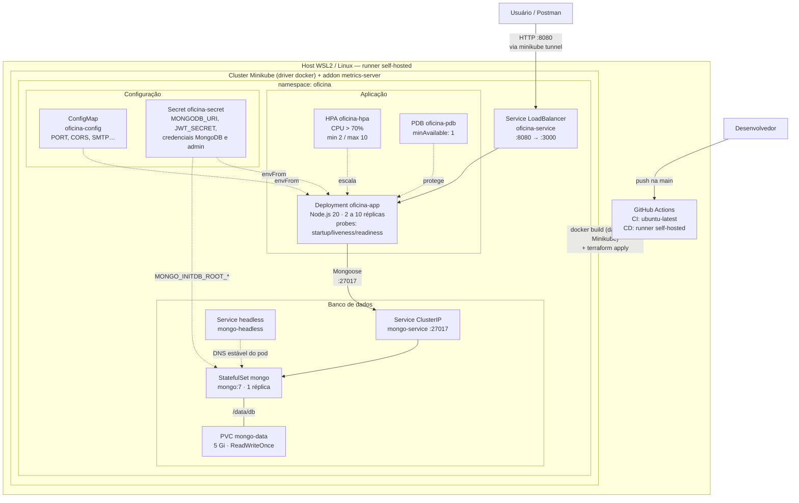

# Desenho de Solução — Infraestrutura

Visão da infraestrutura provisionada: cluster Kubernetes (Minikube), recursos do namespace `oficina` e o caminho do tráfego do usuário até o banco de dados.

Complementa as outras duas visões da arquitetura:

- Componentes da aplicação: [docs/architecture/c4.md](../architecture/c4.md)
- Fluxo de deploy (CI/CD): [deploy-flow.md](deploy-flow.md)

## Diagrama

## Recursos provisionados

Todos os recursos abaixo são aplicados pelo Terraform (`infra/`) a partir dos manifests em `/k8s` — detalhes de dependências e variáveis em [deploy-flow.md](deploy-flow.md#terraform-resources-infra).

| Recurso | Nome | Função na solução |
|---|---|---|
| Namespace | `oficina` | Isola todos os recursos da aplicação |
| Deployment | `oficina-app` | API Node.js com rolling update, probes e limites de CPU/memória |
| HorizontalPodAutoscaler | `oficina-hpa` | Escala de 2 a 10 réplicas quando CPU > 70% (requer metrics-server) |
| PodDisruptionBudget | `oficina-pdb` | Garante ao menos 1 réplica durante disrupções voluntárias |
| Service (LoadBalancer) | `oficina-service` | Expõe a API em `localhost:8080` via `minikube tunnel` |
| ConfigMap | `oficina-config` | Variáveis não sensíveis (porta, CORS, SMTP) |
| Secret | `oficina-secret` | Variáveis sensíveis (URI do MongoDB, JWT, credenciais) — gerado pelo Terraform via `templatefile()` |
| StatefulSet | `mongo` | MongoDB 7 com identidade estável e volume persistente |
| Service (ClusterIP) | `mongo-service` | Acesso interno da API ao MongoDB na porta 27017 |
| Service (headless) | `mongo-headless` | DNS estável por pod, exigido pelo StatefulSet |
| PersistentVolumeClaim | `mongo-data-mongo-0` | 5 Gi (ReadWriteOnce) para `/data/db` |

## Decisões e trade-offs

- **Minikube via runner self-hosted em vez de cloud**: elimina custo de infraestrutura gerenciada mantendo CI/CD completo; o trade-off é a dependência de uma máquina local ligada para o CD executar.
- **MongoDB como StatefulSet no cluster em vez de banco gerenciado**: mantém todo o provisionamento reproduzível via Terraform + manifests; o trade-off é operar backup/retenção manualmente (PVC de 5 Gi).
- **Service LoadBalancer + `minikube tunnel` em vez de Ingress**: menor complexidade para um único serviço exposto; um Ingress passaria a valer a pena com múltiplos serviços ou TLS.
